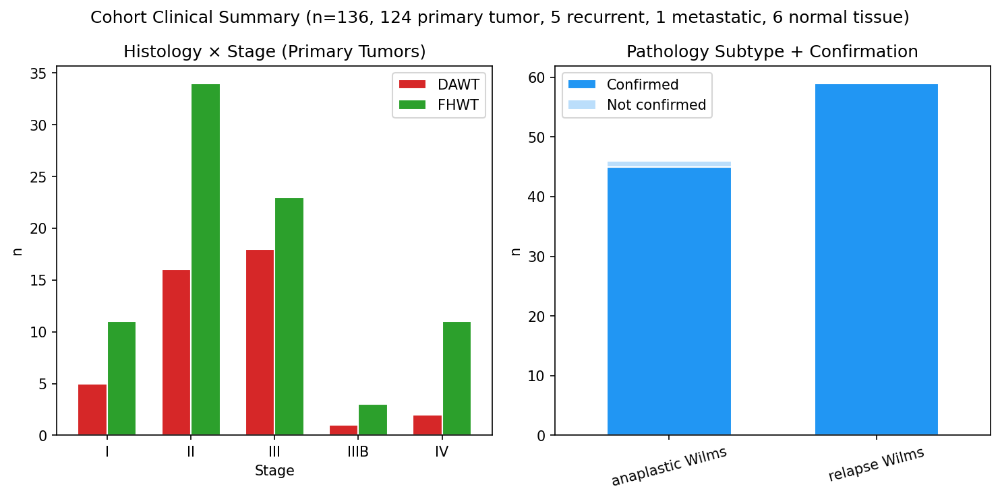
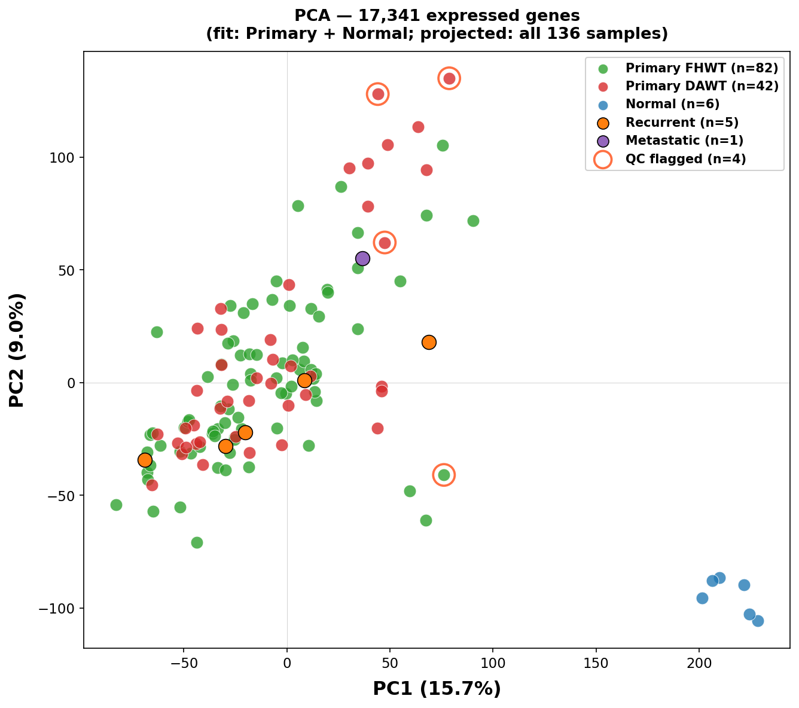
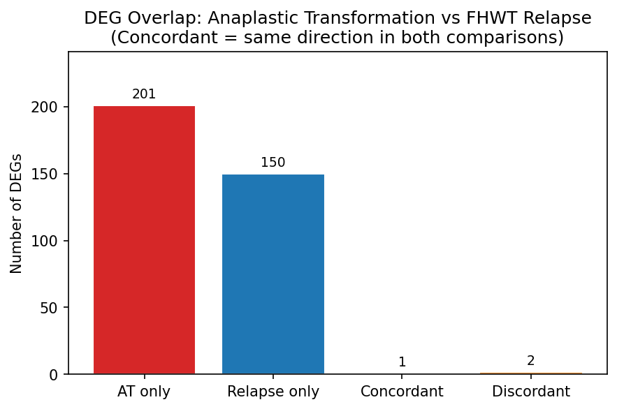
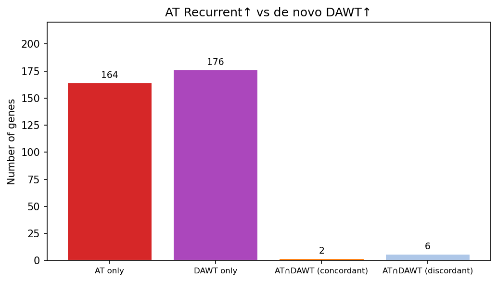
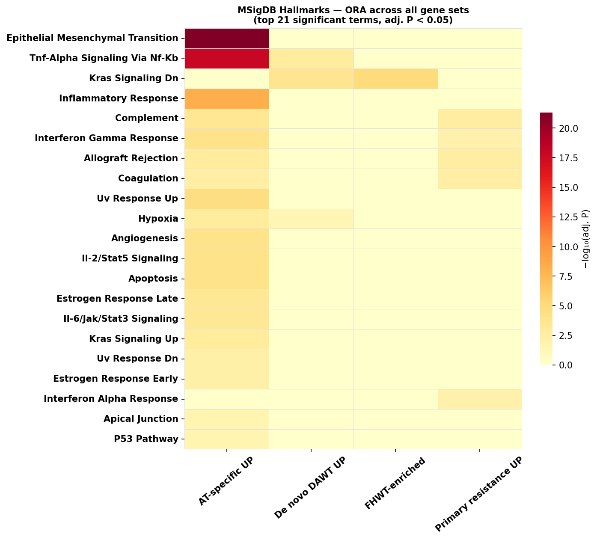
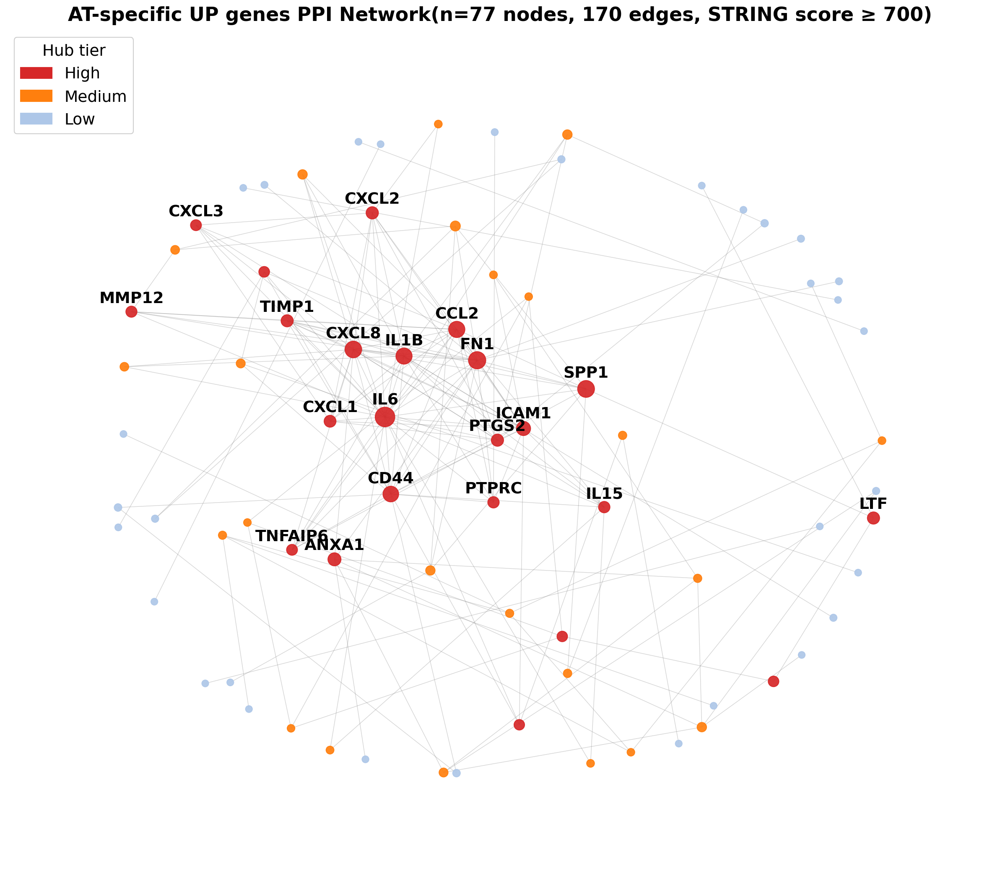
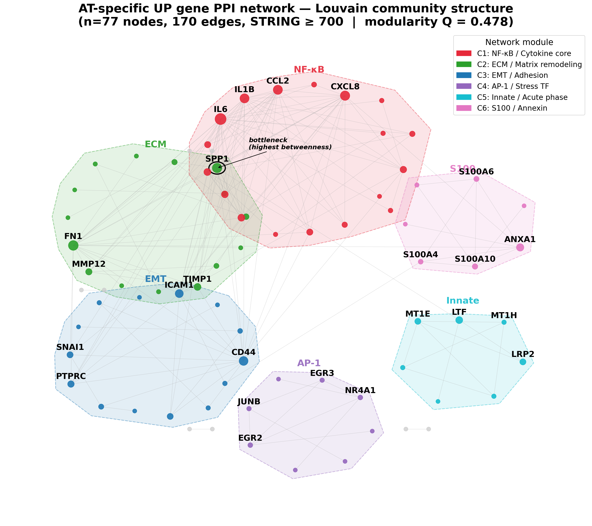
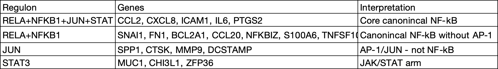
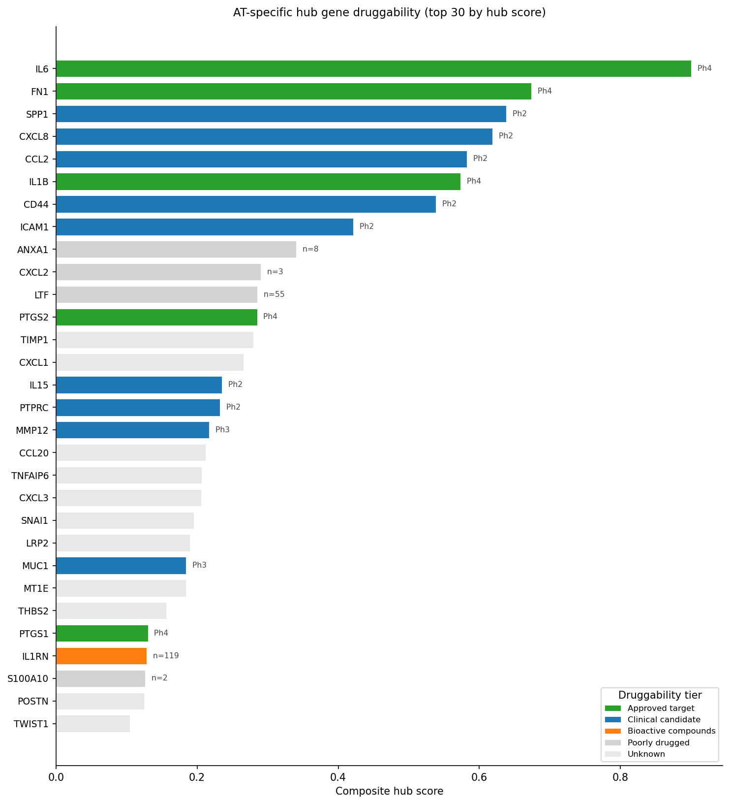

# Acquired Anaplastic Transformation in Wilms Tumor Engages an Unique NF-κB/EMT Program Distinct from De Novo Anaplastic Disease

NCI GDC TARGET-WT (n = 136 samples) | RNA-seq | Somatic Mutations (n = 42 samples)

---

## Abstract

This study profiles the transcriptomic landscape of Wilms tumor aggressiveness using the NCI TARGET-WT RNA-seq cohort. Focusing on the axis of FHWT progression (primary resistance) -  FHWT relapse (secondary resistance) - Anaplastic Transformation(AT) versus DAWT (de-novo anaplastic tumor), we show that AT arrives through an almost entirely independent transcriptional program. While it originally classified as favorable histology and acquired diffuse anaplastic histology at relapse, recurrent samples share only 7 genes with de novo DAWT and 1 gene with standard FHWT relapse programs. The AT-specific program is dominated by NF-κB/AP-1-driven inflammatory reprogramming and epithelial-mesenchymal transition and further network analysis reveals a modular architecture in which SPP1/osteopontin serves as the structural bottleneck between the cytokine and mesenchymal programs. Further upstream transcription factor inference via TRRUST identified the canonical RELA/NF-κB complex as the primary regulatory driver of the entire AT network, making bortezomib the highest-priority intervention option. Following network topology, three other orthogonal therapeutic strategies emerge for relapsed anaplastic Wilms tumor: anti-IL-6/IL-6R blockade (tocilizumab) and COX-2 inhibition (celecoxib), SPP1 (Osteopontin) as a bottleneck, and the SNAI1/TWIST1-driven EMT program. An emerging repurposing opportunity is Niclosamide — an FDA-approved anthelminthic with a multi-target profile across S100A10 suppression, STAT3 inhibition, and Wnt blockade. It has shown broad preclinical anti-tumor activity in various cancers, including Wilms tumor cell lines.

---

## Rationale

Wilms tumor (nephroblastoma) is the most common renal malignancy of childhood, and while overall survival exceeds 90% for localised favorable histology disease, a small subset of patients progress to anaplastic histology at relapse. These *anaplastic transformation* (AT) patients — tumors initially classified as favorable histology (FHWT) that acquire diffuse anaplasia by the time of recurrence — face near-universal treatment failure with no established salvage standard of care. An unresolved question is whether AT represents the same disease as de novo diffuse anaplastic Wilms tumor (DAWT), just arriving later, or whether it is a biologically distinct entity that happens to share a histological endpoint.

Using the NCI TARGET-WT RNA-seq cohort (136 samples), we characterised three complementary axes of Wilms tumor aggressiveness — histological identity, relapse trajectory, and anaplastic transformation — and applied pathway enrichment, protein interaction network analysis, and druggability mapping to the acquired anaplastic transcriptome. The answer to the question above is unambiguous: **acquired anaplasia is its own disease**, driven by an NF-κB-centered inflammatory and mesenchymal rewiring program that is largely absent from de novo DAWT.

---

## Highlights

- **Acquired anaplasia activates a unique transcriptional program.** Of 172 genes upregulated in AT recurrent specimens, 163 (95%) are absent from the de novo DAWT anaplastic program — suggesting that histologically identical anaplasia arises through largely independent molecular routes.

- **NF-κB is the master regulator of acquired anaplasia.** ORA and GSEA across four databases convergently identify RELA/NFKB1/JUN as the dominant upstream drivers of the AT transcriptome (TRRUST NES > 1.85, FDR < 0.001). Epithelial-Mesenchymal Transition (Hallmarks OR = 19.2, padj = 4.9 × 10⁻²²) and TNF-alpha Signaling via NF-κB (OR = 16.6, padj = 1.1 × 10⁻¹⁸) are the top enriched terms, co-activated rather than independent.

- **NF-κB is the sole convergence point of de novo and acquired anaplasia.** The only Hallmark shared by both the AT-specific and DAWT programs is TNF-alpha Signaling via NF-κB. The 7 concordant AT∩DAWT genes (*FOS*, *EGR1*, *SERPINE1*, *MMP9*, *COL10A1*, *STEAP4*, *SPRR2F*) are all NF-κB/AP-1 downstream targets.

- **AT is not a molecular extreme of standard FHWT relapse.** Overlap between AT recurrent UP genes and the FHWT relapse/progression signature is near-zero (1 concordant gene, *COL11A1*). The three routes to treatment failure — primary resistance (FHWT progression), secondary resistance (FHWT relapse), and anaplastic transformation — activate non-overlapping transcriptional circuits already distinguishable in primary tumor specimens at diagnosis.

- **Primary resistance is pre-wired at diagnosis as an immune program.** Primary FHWT tumors destined to never achieve complete remission carry a baseline immune signature (Allograft Rejection NES = −2.33; Interferon Gamma NES = −2.32; STAT1 and REL as TF regulators) before any treatment has been delivered. Secondary resistance (relapse) tumors are instead enriched for Wnt/LEF1 activity — a differentiated, nephron-like identity consistent with initial treatment sensitivity.

- **De novo DAWT is defined by hyper-proliferative cell cycle drive, not inflammation.** The de novo anaplastic program is dominated by MYC/E2F/mTOR targets (mTORC1 NES = −2.11; E2F Targets NES = −1.98; MYC Targets V1 NES = −1.85) — a proliferative axis entirely absent from the AT recurrent program. These are transcriptionally distinct diseases.

- **The Core AT PPI network has four major functional modules, with SPP1/osteopontin as the structural bottleneck.** Of 163 AT-specific genes, 78 form a connected STRING network (confidence ≥ 700) organised into an NF-κB/cytokine core (C1), an ECM/matrix module (C2), an EMT/adhesion module (C3), and an AP-1/stress TF module (C4). SPP1 (osteopontin) sits at the inter-module interface with the highest betweenness centrality (0.043), bridging all three major modules — removing it computationally disconnects cytokine signaling from EMT more effectively than removing any other single node.

- **Top therapeutic priorities:**  ChEMBL v34 mapping identifies two FDA-approved targets (IL-6, PTGS2/COX-2), three clinical-stage candidates (ABCB1/P-gp, MMP12, CD44), and SPP1 as the top network bottleneck target. These cover three orthogonal resistance mechanisms: inflammatory amplification (IL-6 → JAK/STAT3), prostaglandin-NF-κB feedback (COX-2), and efflux-based chemoresistance (ABCB1/MDR1).  Hovewer, a proteasome inhibitoror drug bortezomib emerges as the highest-priority intervention, it targets the identified master regulator (RELA/NFKB1) upstream of the entire AT transcriptional program.

- **Niclosamide as a multi-target repurposing opportunity.** The Network topology further reveals two therapeutically relevant nodes: S100A10 (apoptosis threshold elevation, dual-mechanism with ABCB1 chemoresistance) and S100A4/RAGE (paracrine NF-κB amplification and invasion). Niclosamide — an FDA-approved anthelminthic with established safety — transcriptionally suppresses S100A10, blocks STAT3 phosphorylation (STAT3 is the downstream effector of IL-6/JAK signalling), and inhibits Wnt/β-catenin (LRP6 endocytosis), simultaneously targeting three mechanisms active in the AT resistance program. Preclinical activity has been demonstrated in Wilms tumor cell lines (WT-CLS1, SK-NEP-1) and in a range of pediatric solid tumors including Ewing's sarcoma and rhabdomyosarcoma. Niclosamide is currently in early oncology repurposing trials for colorectal cancer (NCT02532114) and pediatric refractory AML (NCT05188170). No Wilms-specific clinical trial has been conducted.

---

> 📄 **[Full version of the manuscript draft (wip 10_05_2026)](docs/manuscript_draft.md)**

> 📄 **[Supplementary Figures](docs/Supplementary_figures.md)** 

> 📄 **[Supplementary Analysis: Somatic Mutations](docs/Supplementary_analysis_mutations.md)** - not included in the main analysis.

---

## Results

### Figure 1 — Cohort Overview



The TARGET-WT cohort comprises 136 samples: 124 primary tumors (82 FHWT, 42 DAWT), 6 solid tissue normals, 5 recurrent tumors, and 1 metastatic specimen. Stage II–III disease predominates (n = 95 of 124 primary tumors). All patients were treated according to the NWTS-5 (National Wilms Tumor Study-5) protocol, providing a uniform treatment background across the cohort. Four patients with histologically confirmed anaplastic transformation contribute matched primary (FHWT) and recurrent (anaplastic) specimen pairs to the AT analysis and are excluded from the main preprocessing cohort to prevent confounding the FHWT/DAWT comparison.

---

### Figure 2 — PCA



PCA fitted on the 130 primary tumor plus normal samples and projected across all 136. PC1 (15.6% variance) separates normal from tumor; PC2 (9.0%) partially separates FHWT from DAWT. The five AT recurrent specimens project into the tumor cloud rather than clustering separately — consistent with focused transcriptional rewiring rather than a wholesale expression state shift. Four QC-flagged outlier samples (mean within-tumor Pearson *r* < 0.90) are annotated with orange rings and excluded from differential expression analyses.

---

### Figure 3 — AT Recurrence vs FHWT Relapse-specific genes: Near-Zero Overlap



Overlap between AT recurrent UP genes (n = 172) and FHWT relapse/progression DEGs (n = 153) yields only 1 concordant gene (*COL11A1*). This near-complete non-overlap directly demonstrates that anaplastic transformation is not a transcriptional extreme of standard FHWT relapse — it is a biologically separate route to treatment failure. Primary and secondary FHWT resistance (immune-enriched vs Wnt-active programs) are themselves non-overlapping, giving three orthogonal failure modes that are pre-determined at the level of primary tumor transcriptomics.

---

### Figure 4 — AT Recurrence vs De Novo DAWT: 95% Non-Overlap



Overlap between AT recurrent UP genes (n = 172) and the de novo DAWT anaplastic program (n = 94) identifies only 7 concordant genes: *FOS*, *MMP9*, *EGR1*, *SERPINE1*, *STEAP4*, *COL10A1*, and *SPRR2F* — all downstream of NF-κB/AP-1 and collectively forming a shared stress-response/ECM module. The remaining 163 AT-specific UP genes (95%) are absent from the DAWT program. Histologically identical anaplasia arises through largely distinct transcriptional routes; therapeutic strategies designed for de novo DAWT cannot be assumed to address the acquired anaplastic program.

---

### Figure 5 — MSigDB Hallmarks Heatmap: Four Organising Axes



Cross-comparison ORA heatmap (−log10 adjusted P-value) across all six gene sets and 50 MSigDB Hallmarks reveals four structurally distinct axes. The **MYC/E2F/G2M proliferative axis** is DAWT-specific and absent from AT. The **NF-κB/TNF node** (TNF-alpha Signaling via NF-κB) is the only Hallmark shared by de novo and acquired anaplasia — the molecular intersection of two independent routes to anaplastic histology. The **Interferon/Complement/Allograft immune cluster** defines primary FHWT resistance and unexpectedly co-activates in AT recurrence, suggesting a shared innate immune program in therapy-refractory Wilms tumor. **Wnt-beta Catenin Signaling** is secondary resistance-specific, marking the differentiated, therapy-sensitive phenotype. The KRAS axis inverts sign at transformation: KRAS Signaling Dn in both primary histological classes, KRAS Signaling Up exclusively in AT recurrence.

---

### Figure 6 — AT-Specific PPI Network



STRING PPI network (confidence ≥ 700, functional interactions) for the 163 AT-specific UP genes. Of 163 input genes, 78 form a connected component (177 edges); the remaining 85 are isolated within this network, reflecting their regulation as transcriptional outputs of shared enhancers rather than direct biochemical partners. Node size encodes composite hub score. The flat appearance of the network can be explained by a co-regulated cytokine storm module, most probably activated by the AT program.  IL6, CXCL8, CCL2, IL1B, CXCL1/2/3 - are all direct NF-κB transcriptional outputs. In STRING's functional network, they're densely interconnected via co-expression and co-mention, so they form a near-clique. 

The bridge that connects the cytokine cluster to the rest of the network: SPP1 has a moderate degree but the highest betweenness in the entire network. 

---

### Figure 7 — Louvain Community Structure



Louvain community detection (modularity Q = 0.474) partitions the AT network into 6 major communities, the first four of which account for 56 of 78 connected nodes. 

**Module 1 (NF-κB/cytokine core, n = 19):** IL6, CXCL1/2/3/8, CCL2/20, IL1B/IL1RN, PTGS1/2, TNFAIP6, TLR5, NFKBIZ — a near-clique of co-regulated NF-κB output genes with high redundancy; single-cytokine blockade is expected to have limited network-level impact.

**Module 2 (ECM/matrix, n = 15):** FN1, MMP12, COL11A1, POSTN, COMP, CTHRC1, SPP1 — the structural remodeling arm of EMT. 

**Module 3 (EMT/adhesion, n = 14):** SNAI1, TWIST1, CD44, ICAM1, MUC1, LAMA3/LAMB3 — the canonical EMT transcription factors and surface identity shift. 

**Module 4 (AP-1/stress TF, n = 8):** EGR2/3/4, JUNB, NR4A1, AKT3, BCL2A1 — a secondary transcriptional relay. 

**Module 5 (Innate/acute phase, n = 7)** LTF, MT1E/G/H, DMBT1

**Module 6 (S100/Annexin, n = 7)** ANXA1, S100A4/6/10/16

NF-κB directly transcribes both master EMT regulators (*SNAI1*, *TWIST1*), wiring the inflammatory and mesenchymal programs together at the transcriptional level rather than exclusively through paracrine cytokine signals (See the transcription factor analysis section). 

SPP1 (osteopontin) is highlighted as the highest-betweenness node, structurally bridging the cytokine, ECM, and EMT functional clusters despite ranking only 9th by degree — a topology that identifies it as the network's principal communication bottleneck.
SPP1 is secreted by tumor-associated macrophages (TAM), promoting tumor immune evasion. Inhibiting SPP1 can reverse this suppression.

Following this topology and given high redundancy within the C1 cluster, the three tractable entry points for targeting are applicable:  
 - upstream of C1 (IL-6R → tocilizumab, COX-2 → celecoxib) 
 - between C1 and C2 (SPP1 bottleneck) 
 - and within C3 (SNAI1/TWIST1-driven EMT arm)

---
### Note on Annexin Module


Community 6 proteins (ANXA1, S100A4, S100A6, S100A10, S100A16, ANXA2R, HSH2D) co-cluster because they share calcium-dependent lipid-binding interactions and are co-expressed in contexts of inflammatory stress and cellular remodeling. S100A10 — the most actionable target in the list, it suppresses apoptosis by anchoring to the plasma membrane via ANXA2, where it activates plasminogen, driving MMP-mediated matrix degradation and protecting cells from anoikis. S100A10 knockdown consistently sensitizes cancer cells to chemotherapy-induced death across multiple tumor models. In the AT program, S100A10 upregulation likely contributes to the resistance phenotype alongside ABCB1. 

**S100A10** anti-apoptotic function is well-validated. **Niclosamide** downregulates S100A10 transcription, blocks STAT3 phosphorylation (downstream effector of IL-6/JAK), and inhibits Wnt/β-catenin, targeting three mechanisms active in the AT resistance program. Annexin A2/S100A10 complex disruption sensitizes cells to trail-mediated and chemotherapy-induced apoptosis in preclinical models.

**S100A4 (Metastasin/MTS1) and the RAGE axis** S100A4 is a well-validated pro-metastatic and pro-invasive protein acting through two mechanisms: extracellularly, secreted S100A4 binds RAGE (Receptor for Advanced Glycation End-products, encoded by AGER), activating NF-κB and upregulating MMPs in recipient cells — a paracrine amplification loop that connects C6 to the cytokine core (C1) and ECM module (C2). Intracellularly, S100A4 binds non-muscle myosin IIA, disrupting cytoskeletal organisation and promoting amoeboid motility. The RAGE receptor has been clinically explored as a drug target in neurodegeneration: the small-molecule antagonist azeliragon (TTP488) completed Phase 3 (NCT02080364) for Alzheimer's disease, demonstrating safety and blood-brain barrier penetrance. FPS-ZM1 blocks RAGE-mediated S100A4 signalling in invasion models. Pentamidine, an FDA-approved antiprotozoal, disrupts the S100A4-myosin IIA interaction at low micromolar concentrations in preclinical models and represents a second repurposing opportunity. Importantly, RAGE is also activated by multiple DAMPs and alarmins released from the inflammatory tumor microenvironment generated by Module 1, suggesting that RAGE blockade could attenuate both the S100A4-driven invasion arm and the broader paracrine NF-κB amplification loop simultaneously.

**ANXA1** is the highest-betweenness member of the module, but its signaling is complicated. Annexin 1 can be pro-apoptotic in lymphoid tumors but pro-survival and pro-EMT in epithelial tumors. ANXA1 is primarily an anti-inflammatory mediator: it's secreted in response to glucocorticoids and suppresses neutrophil migration via FPR1/FPR2 receptors. In the AT context it's probably being upregulated to dampen the inflammatory storm the tumor is generating — a paracrine negative-feedback loop. However, in the epithelial context of Wilms tumor, the pro-survival arm might dominate. Importantly, ANXA1 also acts as an "eat-me" signal when exposed on the outer leaflet of apoptotic cells — so inhibiting it could actually impair phagocytic clearance of dead cells.

---
### Table 1 - Transcription Factor Analysis

To distinguish genes in the AT-specific program that are direct transcriptional targets of NF-κB from those upregulated through indirect or paracrine mechanisms, the 163 AT-specific UP genes were cross-referenced against TRRUST v2 (Transcriptional Regulatory Relationships Unravelled by Sentence-based Text-mining), a manually curated compendium of human TF–target relationships.

Upstream transcription factor inference via TRRUST identifies the canonical NF-κB complex as the primary regulatory driver: RELA (p65; OR = 12.5, padj = 4.3 × 10⁻¹⁶) and NFKB1 (p50; OR = 10.6, padj = 4.1 × 10⁻¹³) are the top two hits, followed by JUN (OR = 16.2, padj = 2.9 × 10⁻¹⁰) — the AP-1 component that co-activates with NF-κB at shared enhancers.
These findings indicate that NF-κB directly wires the EMT program at AT, it doesn't need to signal through cytokines to activate EMT.  Both master EMT transcription factors are direct NF-κB outputs — SNAI1 (LFC=1.15, C3) is a direct RELA+NFKB1 target, and TWIST1 (LFC=1.39, C3) is RELA+JUN+STAT3. 




---
### Figure 8 — Druggability Landscape and Therapeutic Priorities



ChEMBL v34 druggability mapping of the 163 AT-specific genes identifies a tractable therapeutic landscape across 
three tiers. 

**Tier 1 (FDA-approved):** PTGS2/COX-2 (celecoxib — prostaglandin E2-mediated NF-κB amplification) and IL-6 (siltuximab/tocilizumab — dominant JAK/STAT3 inflammatory axis). 

**Tier 2 (clinical-stage):** ABCB1/P-gp (tariquidar — MDR1-mediated efflux resistance to dactinomycin, doxorubicin, vincristine), MMP12 (AZD1236), CD44 (RG7356), CXCL8 (BMS-986253), AKT3 (M2698). 

**Emerging:** AHR antagonist BAY 2416964 (Phase 1/2) — NF-κB/DRE co-activation; niclosamide (FDA-approved anthelminthic, multi-target repurposing: S100A10 suppression + STAT3 inhibition + Wnt blockade). 

**Network priority:** SPP1 as the top betweenness bottleneck, RUNX1 and NR4A1 as AT-specific TF nodes with active preclinical programs.

---

## Note on Somatic Mutations Analysis

Somatic mutation profiling was performed on the WES subset of the TARGET-WT cohort (42 MAF files, 38 unique patients — 37 with matched clinical data; 4 files are duplicate aliquots from the same tumor sample). Since the WES data are available for primary tumor samples, but not for AT recurrent specimens — the central subject of this study, somatic mutation results are presented as [Supplementary Analysis](docs/Supplementary_analysis_mutations.md) of the primary-tumor genomic background and not integrated into the main analysis.

The genetic architecture of the AT event itself — whether the TP53 mutation present at primary diagnosis is sufficient, or whether additional somatic alterations drive the transformation — cannot be determined from this dataset. Theserefore, we cannot exclude a mutational contribution to the transcriptional rewiring observed.

---

## Additional Limitations

**Sample size.** The anaplastic transformation cohort comprises 4 matched primary–recurrent pairs (n = 8 samples), yielding a residual degrees of freedom of 3 in the paired DESeq2 model. All AT results are explicitly exploratory and should be interpreted as hypothesis-generating. Effect size estimates are likely inflated and statistical confidence is limited by design.

**Bulk RNA-seq resolution.** All analyses use bulk transcriptomics, which averages across heterogeneous cell populations — tumor epithelium, stroma, endothelium, and immune infiltrate. The immune signatures identified in primary resistance and AT recurrence could reflect genuine tumor-cell-intrinsic gene expression changes or differences in microenvironmental cell composition. Single-cell or spatial transcriptomics would be required to resolve this ambiguity.

**Pathway databases reflect known biology.** ORA and GSEA results are bounded by the completeness of curated pathway databases. Novel, uncharacterised regulatory relationships — which may be particularly relevant in pediatric cancer contexts — are not captured.

---

## Discussion

The presented analysis demonstrates that AT in Wilms tumor is neither a later-arriving form of de novo anaplastic disease, nor an transcriptional extreme of standard FHWT relapse — it is a biologically independent entity that happens to converge on the same histological endpoint through a largely non-overlapping molecular route. The AT-specific program is dominated by NF-κB/AP-1- driven inflammatory reprogramming and epithelial-mesenchymal transition — an activating transcriptional event that simultaneously upregulates ABCB1/MDR1 (efflux-based chemoresistance), IL6/PTGS2 (inflammatory amplification), and SNAI1/TWIST1 (EMT identity shift), with RELA, NFKB1, and JUN as the primary upstream drivers. This conclusion has direct therapeutic implications: treatment strategies designed for de novo DAWT, which is driven by a MYC/E2F/mTOR proliferative axis, cannot be assumed to address the acquired anaplastic program. 

**NF-κB as a conserved driver of pediatric therapy resistance.** 

The centrality of NF-κB in the AT program is not an isolated observation, it is in line with the previous single-cell studies. For example, a recent study by Grossmann et al., conducted on 20 matched diagnosis/post-induction surgery neuroblastoma pairs, identified four chemotherapy persister meta-modules, of which two — NFκB/stemness and NFκB/stress — are NF-κB-dominant and together account for the majority of residual disease cells [1]. Functional validation using CRISPR knockout of RelA and pharmacological IKKβ inhibition substantially reduced persister cell survival, establishing NF-κB not merely as a transcriptional correlate but as a causal dependency in pediatric solid tumor chemoresistance. The convergence of NF-κB-centered resistance across two histologically and developmentally distinct pediatric cancers — neuroblastoma and Wilms tumor — argues that this pathway represents a conserved vulnerability in childhood solid tumors, and strengthens the rationale for prospective NF-κB-targeting strategies in both diseases. 

**NF-κB/EMT mechanistic coupling.** 

A key architectural feature of the AT program is that NF-κB does not merely activate cytokine signaling — it directly transcribes the master EMT regulators SNAI1 and TWIST1, wiring inflammatory reprogramming and mesenchymal identity shift together at the transcriptional level. This topology recapitulates the neuroblastoma persister data, where the transcription factor PRRX1 couples the NFκB/stemness module to a mesenchymal cell state, and where CD44 — a canonical NF- κB/stemness surface marker and a direct DEG in our AT program — is among the highest- expressed surface antigens in persister cells [1]. The parallel coupling of NF-κB activity to a mesenchymal/stem-like identity across two pediatric cancers suggests a shared regulatory logic: NF-κB activation at relapse is not simply inflammatory noise but is mechanistically linked to the acquisition of a therapy-refractory, dedifferentiated phenotype. 

**Opposing metabolic trajectories: KRAS inversion and MYC suppression.** 

The hallmarks cross-comparison reveals an unexpected feature of the AT transcriptome: KRAS Signaling is downregulated in both primary FHWT and primary DAWT tumors, but specifically inverts to strong upregulation at AT transformation — a sign-switching pattern not observed in any other comparison. This mirrors findings from Grossmann et al., where MYC(N) target gene activity is suppressed during the chemotherapy persistence phase and is only restored at relapse [1]. Both observations point to a shared principle: the transition from treatment-sensitive primary disease to refractory residual disease involves a deliberate shift away from high-proliferative, oncogene-driven growth toward a slower-cycling, stress-adapted state with NF-κB at its core. In AT Wilms tumor, the KRAS axis inversion may represent the transcriptional signature of this metabolic and proliferative deceleration occurring in real time at recurrence. 

**Tumor microenvironment as a NF-κB amplifier**. 

Our network analysis identifies the AT cytokine module (C1) as a near-clique of co-regulated NF-κB outputs — IL6, CXCL1/2/3/8, CCL2/20, IL1B, PTGS1/2 — with SPP1/osteopontin as the structural bottleneck bridging this cytokine core to the EMT and ECM modules. This architecture is consistent with a paracrine amplification loop in which tumor-cell NF-κB activity drives cytokine secretion that recruits and activates cancer-associated fibroblasts (CAFs) and tumor-associated macrophages (TAMs), which in turn sustain NF-κB activity in tumor cells through reciprocal signaling, further supporting the  CAF/TAM paracrine loop mechanism described in neuroblastoma persisters [1]. Given the fact that our AT cohort consists of bulk RNA-seq data, SPP1 — which is secreted by both tumor cells and macrophages — may mark the interface between tumor-intrinsic NF-κB activity and microenvironmental amplification. Resolving this ambiguity would require spatial transcriptomics or scRNA-seq on AT recurrent specimens, currently unavailable in the TARGET-WT dataset. 

**Therapeutic implications.** 

The mechanistic parallels with neuroblastoma persister biology reinforce and extend the therapeutic priorities identified here. 

1. Upstream IKKβ/NF-κB inhibition — rather than individual cytokine blockade against the redundant C1 module — emerges as the highest-priority intervention supported by functional evidence across two independent pediatric cancer datasets. The immediate and direct treatment is **bortezomib**. It hits the identified master regulator (RELA/NFKB1) upstream of the entire AT transcriptional program — more upstream than anti-IL-6, COX-2 feedback loop or even IKKβ inhibitors, which are one step upstream. Bortezomib stabilizes IκBα, directly suppressing RelA/NF-κB. The proteasome degrades IκBα (the cytoplasmic NF-κB inhibitor) as the canonical activation step — IκBα is ubiquitinated and proteasomally degraded, freeing RelA/p65 for nuclear translocation. Bortezomib blocks that degradation, so IκBα accumulates and sequesters NF-κB in the cytoplasm. In addition, In context of EMT, the proteasome mediates ubiquitin-dependent degradation of SNAI1 — one of the two master EMT transcription factors directly upregulated in AT (Module 3). Bortezomib could therefore suppress the EMT arm of the AT program through a second mechanism independent of NF-κB. Given existing clinical availability and the direct presence of IL6 and PTGS2 in the AT cytokine module, other options include anti-IL-6 axis blockade (siltuximab, tocilizumab) and COX-2 inhibition (celecoxib), but should be viewed as partial interventions against a redundant network rather than root-cause treatment.

2. The SPP1 (Osteoponin) bottleneck, NR4A1(Nur77), and RUNX1(AML1) represent AT-specific network nodes absent from the de novo DAWT program, offering a therapeutic window that could spare the proliferative axis selectively. 
Osteoponin is a multifunctional protein acting as a promising therapeutic target to inhibit cancer progression and metastasis in pancreatic, prostate, esophageal squamous cell carcinoma (ESCC), and cervical cancers. 
Studies targeted SPP1 produced by macrophages with small molecule inhibitors [2] and antibodies showed significantly improved survival in preclinical models.

3. **Niclosamide** — with its multi-target profile across STAT3 inhibition, S100A10 suppression, and Wnt blockade — engages three mechanisms active in the AT resistance program and merits formal evaluation. 

4. A fourth orthogonal mechanism deserves specific mention: XPO1/exportin-1 inhibition with **selinexor**. Coutinho et al. previously applied metaVIPER — a mutation-agnostic, network-based protein activity inference — to the TARGET-WT cohort (the same dataset analysed here) and identified XPO1 as the second most aberrantly activated druggable protein in Wilms tumor (97% of samples, NES IQR 6.43–7.85), validated by cell-cycle arrest and apoptosis in WT cell lines, PDX tumor growth abrogation, and a case report of a multiply relapsed Wilms patient with prolonged disease control on selinexor [4]. 
XPO1 exports IκBα (the cytoplasmic NF-κB inhibitor) out of the nucleus.

    Both selinexor and bortezomib stabilize IκBα, but through complementary mechanisms: selinexor prevents nuclear export of IκBα (retains it in the nucleus where it inactivates RelA), while bortezomib prevents proteasomal degradation of IκBα (keeps it in the cytoplasm where it sequesters RelA). The two mechanisms are additive, which is why bortezomib + selinexor combinations seem to be the most mechanistically elegant option in the whole therapeutic landscape. 
Furthermore, selinexor exports TP53 from the nucleus, potentially restoring partial tumor-suppressive activity even in the TP53-mutant context characteristic of AT primary tumors. Bortezomib, on the other hand, stabilizes both wild-type and mutant TP53 by blocking MDM2-mediated proteasomal degradation — some mutant TP53 isoforms retain partial transcriptional activity when forced into accumulation. 

    Selinexor is currently in a pediatric clinical trial for multiple tumors (NCT02323880), including relapsed Wilms tumor. The cross-cancer NF-κB convergence argues that a basket trial design — enrolling relapsed AT Wilms alongside relapsed neuroblastoma and other pediatric solid tumors with documented NF-κB persister programs — would be scientifically justified and statistically practical given the rarity of each individual histotype.

---
## Quickstart

### Prerequisites

- [Docker Desktop](https://www.docker.com/products/docker-desktop/) (for devcontainer) or conda/mamba for local setup

### 1. Clone and open in devcontainer

```bash
git clone <repo-url>
```

Open in VS Code → **Reopen in Container**, or in PyCharm via devcontainer support (2022.3+). The `postCreateCommand` provisions the full conda environment automatically — no manual setup needed.

### 2. Download the GDC data

```bash
cd scripts/python
python 00a_download_gdc_data.py
```

Queries the GDC REST API and downloads open-access TARGET-WT files (~3 GB). Safe to re-run — existing files are skipped. In addition, it generates `data/processed/tables/sample_metadata.csv`.


### 3. Run the analysis pipeline

```bash
python 00b_build_counts_matrix_and_annotation.py
python 01_clinical_eda.py
python 02_rnaseq_preprocessing.py
python 03_rnaseq_de_histology.py
python 04_rnaseq_de_relapse.py
python 05_rnaseq_de_anaplastic_transformation.py
python 06_pathway_enrichment.py
python 07_ppi.py
python 08_druggability.py
python 09_tf_analysis.py
```

Outputs: figures → `data/results/figures/` | tables → `data/processed/tables/` | matrices → `data/processed/matrices/`

### Local setup (no Docker)

```bash
conda env create -f environment.yml
conda activate project-env
export PYTHONPATH=/path/to/refractory_wilms_study   # project root must be on PYTHONPATH
cd scripts/python
```

### R scripts (somatic mutations, optional)

The R scripts in `scripts/R/` (maftools-based mutation analysis) are kept for reference but are **not part of the main Python analysis pipeline**. To run them, use RStudio directly on your local machine. If you want R available inside the devcontainer, run Bioconductor Docker Container from the project root:

```bash
docker run -e PASSWORD=bioc -p 8787:8787 \
  -v $(pwd)/:/home/rstudio/project \
  -w /home/rstudio/project \
  -it bioconductor/bioconductor_docker: RELEASE_3_21
```
Then open RStudio at http://localhost:8787 (user: rstudio, password: bioc) and run the `scripts/R/00_setup_mutations.R` to install the required packages.

---

## References

1. Grossmann LD, Chen C-H, Uzun Y, et al. Identification and characterization of chemotherapy-resistant high-risk neuroblastoma persister cells. *Cancer Discov.* 2024;14(12):2387–2406. doi:[10.1158/2159-8290.CD-24-0046](https://doi.org/10.1158/2159-8290.CD-24-0046)

2. Kartal B, Garris CS, Kim HS, Kohler RH, Carrothers J, Halabi EA, Iwamoto Y, Goubet AG, Xie Y, Wirapati P, Pittet MJ, Weissleder R. Targeted SPP1 Inhibition of Tumor-Associated Myeloid Cells Effectively Decreases Tumor Sizes. *Adv Sci (Weinh).* 2025 Jan;12(4):e2410360. doi: [10.1002/advs.202410360](https://pmc.ncbi.nlm.nih.gov/articles/PMC11775521/)

3. Li, H., Lan, L., Chen, H. et al. SPP1 is required for maintaining mesenchymal cell fate in pancreatic cancer. Nature 648, 203–209 (2025). [https://doi.org/10.1038/s41586-025-09574-y](https://doi.org/10.1038/s41586-025-09574-y)

4. Coutinho DF, Mundi PS, Marks LJ, et al. Validation of a non-oncogene encoded vulnerability to exportin 1 inhibition in pediatric renal tumors. *Med.* 2022;3(11):774–791. doi:[10.1016/j.medj.2022.09.002](https://doi.org/10.1016/j.medj.2022.09.002)

5. Gadd S, Huff V, Walz AL, et al. A Children's Oncology Group and TARGET initiative exploring the genetic landscape of Wilms tumor. *Nat Genet.* 2017;49(10):1487–1494. doi:[10.1038/ng.3955](https://doi.org/10.1038/ng.3955)

6. Gadd S, Huff V, Skol AD, et al. Genetic changes associated with relapse in favorable histology Wilms tumor: A Children's Oncology Group AREN03B2 study. Cell Rep Med. 2022 Jun 21;3(6):100644. doi:[10.1016/j.xcrm.2022.100644](https://doi.org/10.1016/j.xcrm.2022.100644)

5. Uno K, Rastegar B, Jansson C, Durand G, Valind A, Chattopadhyay S, Bertolotti A, Ciceri S, Spreafico F, Collini P, Perotti D, Mengelbier LH, Gisselsson D. A Gradual Transition Toward Anaplasia in Wilms Tumor Through Tolerance to Genetic Damage. Mod Pathol. 2024 Jan;37(1):100382. doi: [10.1016/j.modpat.2023.100382](https://doi.org/10.1016/j.modpat.2023.100382)

6. Trink Y, Urbach A, Dekel B, et al. Characterization of Continuous Transcriptional Heterogeneity in High-Risk Blastemal-Type Wilms' Tumors Using Unsupervised Machine Learning. Int J Mol Sci. 2023 Feb 9;24(4):3532. doi:[10.3390/ijms24043532](https://doi.org/10.3390/ijms24043532)

7. Love MI, Huber W, Anders S. Moderated estimation of fold change and dispersion for RNA-seq data with DESeq2. *Genome Biol.* 2014;15(12):550. doi:[10.1186/s13059-014-0550-8](https://doi.org/10.1186/s13059-014-0550-8)

8. Zhu A, Ibrahim JG, Love MI. Heavy-tailed prior distributions for sequence count data: removing the noise and preserving large differences. *Bioinformatics.* 2019;35(12):2084–2092. doi:[10.1093/bioinformatics/bty895](https://doi.org/10.1093/bioinformatics/bty895)

9. Muzellec B, Teleńczuk M, Cabeli V, Andreux M. PyDESeq2: a python package for bulk RNA-seq differential expression analysis. *Bioinformatics.* 2023;39(9):btad547. doi:[10.1093/bioinformatics/btad547](https://doi.org/10.1093/bioinformatics/btad547)

10. Wu T, Hu E, Xu S, et al. clusterProfiler 4.0: a universal enrichment tool for interpreting omics data. *Innovation (Camb).* 2021;2(3):100141. doi:[10.1016/j.xinn.2021.100141](https://doi.org/10.1016/j.xinn.2021.100141)

11. Fang Z, Liu X, Peltz G. GSEApy: a comprehensive package for performing gene set enrichment analysis in Python. *Bioinformatics.* 2023;39(1):btac757. doi:[10.1093/bioinformatics/btac757](https://doi.org/10.1093/bioinformatics/btac757)

12. Liberzon A, Birger C, Thorvaldsdóttir H, Ghandi M, Mesirov JP, Tamayo P. The Molecular Signatures Database (MSigDB) hallmark gene set collection. *Cell Syst.* 2015;1(6):417–425. doi:[10.1016/j.cels.2015.12.004](https://doi.org/10.1016/j.cels.2015.12.004)

13. Han H, Cho J-W, Lee S, et al. TRRUST v2: an expanded reference database of human and mouse transcriptional regulatory interactions. *Nucleic Acids Res.* 2018;46(D1):D380–D386. doi:[10.1093/nar/gkx1013](https://doi.org/10.1093/nar/gkx1013)

14. Szklarczyk D, Kirsch R, Koutrouli M, et al. The STRING database in 2023: protein–protein association networks and functional enrichment analyses for any of 14,000+ organisms. *Nucleic Acids Res.* 2023;51(D1):D638–D646. doi:[10.1093/nar/gkac1000](https://doi.org/10.1093/nar/gkac1000)

15. Blondel VD, Guillaume J-L, Lambiotte R, Lefebvre E. Fast unfolding of communities in large networks. *J Stat Mech.* 2008;2008:P10008. doi:[10.1088/1742-5468/2008/10/P10008](https://doi.org/10.1088/1742-5468/2008/10/P10008)

16. Mendez D, Gaulton A, Bento AP, et al. ChEMBL: towards direct deposition of bioassay data. *Nucleic Acids Res.* 2019;47(D1):D930–D940. doi:[10.1093/nar/gky1075](https://doi.org/10.1093/nar/gky1075)

17. Colaprico A, Silva TC, Olsen C, et al. TCGAbiolinks: an R/Bioconductor package for integrative analysis with GDC data. *Nucleic Acids Res.* 2016;44(8):e71. doi:[10.1093/nar/gkv1507](https://doi.org/10.1093/nar/gkv1507)

18. Mayakonda A, Lin D-C, Assenov Y, Plass C, Bhatt DL. Maftools: efficient and comprehensive analysis of somatic variants in cancer. *Genome Res.* 2018;28(11):1747–1756. doi:[10.1101/gr.239244.118](https://doi.org/10.1101/gr.239244.118)

---
*Data source: NCI GDC TARGET-WT (open access). Analysis code: `scripts/python/` (RNA-seq pipeline) and `scripts/R/` (somatic mutations). Supplementary figures and methods: `docs/Supplementary_materials.md`.*
