# Supplementary Figures

### Quality Control

---

**Figure S1. Library size distribution across all 125 preprocessed samples.**
(qc_01_library_sizes.png)

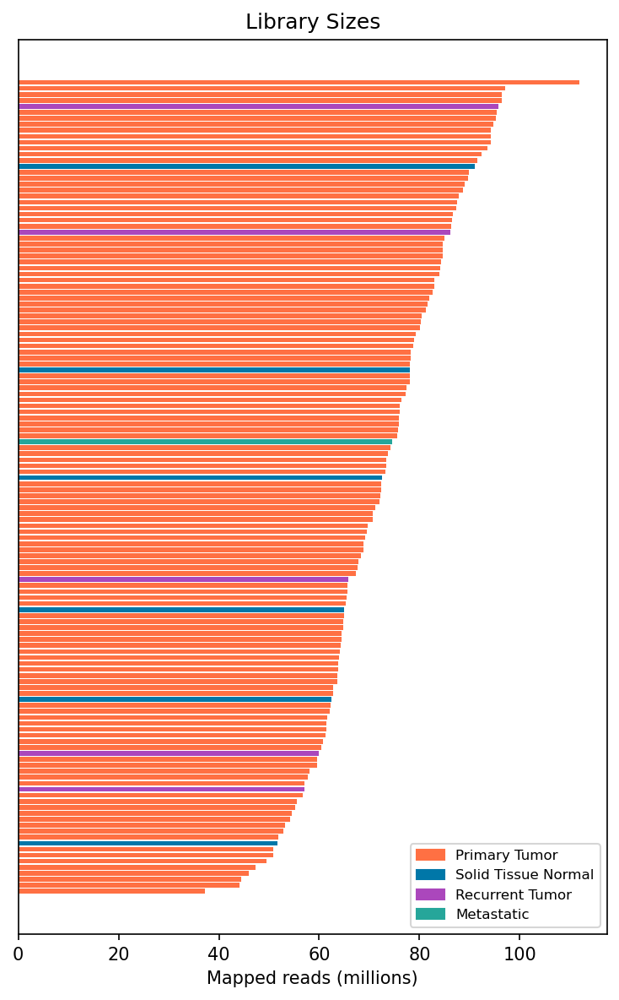

Mapped read counts (library sizes) for all 136 samples, ordered by library size. Colors indicate sample type (Normal, Primary FHWT, Primary DAWT). Library sizes range approximately 10-fold across the cohort with no systematic bias by histological subtype. QC-flagged samples are indicated; they are retained in all normalisation steps.
Library sizes across the 136-sample cohort range approximately 10-fold, with no systematic bias by histological subtype or sample type. Count density distributions are unimodal and well-overlapping after DESeq2 size-factor normalisation, confirming effective normalisation across the library size range. The correlation heatmap (n=130, excluded recurrent and metastatic samples) reveals a strong block structure separating solid tissue normals from primary tumors (within-tumor mean Pearson *r* = 0.90–0.99), with DAWT samples generally showing slightly lower inter-sample correlation than FHWT, consistent with their greater transcriptional heterogeneity. Four samples fail the within-tumor correlation threshold (*r* < 0.90): three are DAWT and one is FHWT; all four are retained in the normalised matrices but excluded from differential expression analyses.

---

**Figure S2. Log2-normalised count density curves for all 125 samples.**
(qc_02_count_density.png)

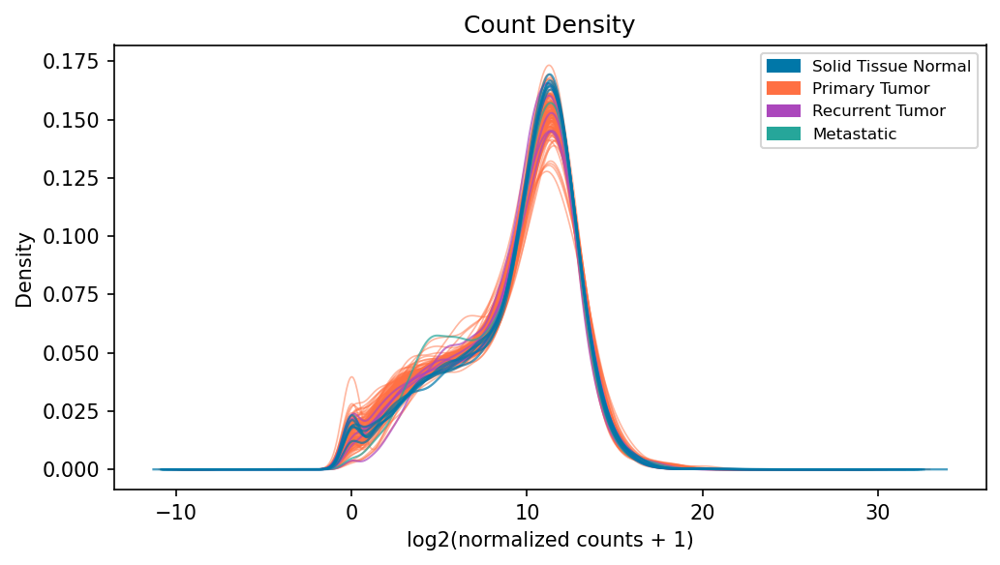

Kernel density estimate (KDE) curves of log2-normalised read counts per gene for each sample. Solid tissue normal samples are plotted as thick lines above the tumor traces. Distributions are unimodal and well-overlapping after DESeq2 size-factor normalisation, confirming effective correction of library size differences. No systematic bimodality or outlier density profile is observed.

---

**Figure S3. Pearson correlation heatmap across all 125 samples.**
(qc_04_sample_correlation.png)

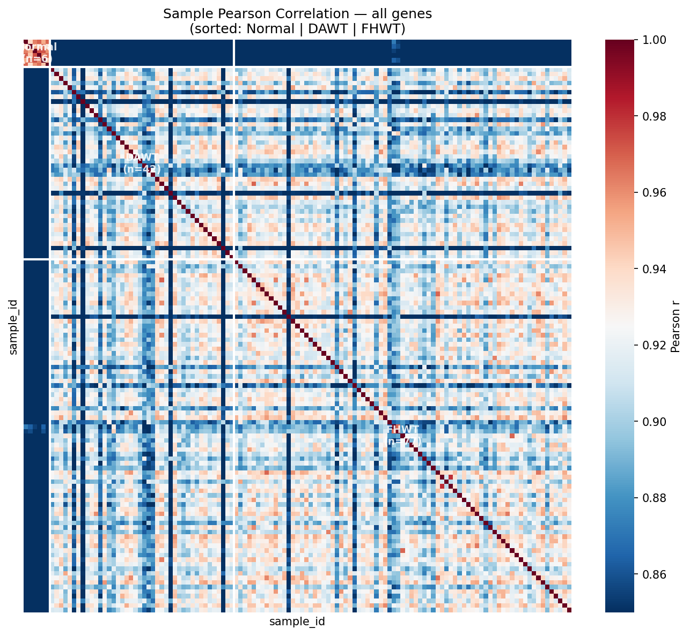

Pairwise Pearson correlation matrix computed across all 17,341 expressed protein-coding genes for the 125-sample cohort. Samples are sorted by sample type and histology; the colour scale spans *r* = 0.70–1.00. White separator lines demarcate group boundaries. A strong block structure separates solid tissue normals from primary tumors (within-tumor mean Pearson *r* = 0.90–0.99). DAWT samples show slightly lower inter-sample correlation than FHWT, consistent with their greater transcriptional heterogeneity. Four QC-flagged outlier samples (mean within-tumor *r* < 0.90) are highlighted with orange ring markers.

---

### Differential Expression: DAWT vs FHWT Primary Tumors (Step 1)

---

**Figure S4. Volcano plot — DAWT vs FHWT (n = 76 FHWT reference, n = 39 DAWT).**
(de_hist_01_volcano.png)

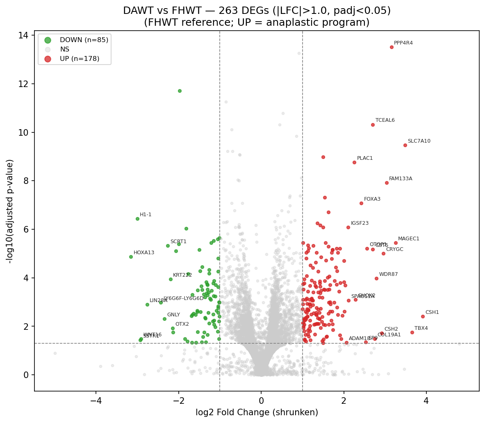

Volcano plot of all 17,341 tested genes in the DAWT vs FHWT primary tumor comparison, using FHWT as the reference level. Genes upregulated in DAWT (the de novo anaplastic program; log2FC > 1.0, padj < 0.05) are shown in red (n = 94); genes upregulated in FHWT are shown in green (n = 173). The top 20 genes by absolute LFC are labelled. Dashed lines mark the |log2FC| = 1.0 and padj = 0.05 thresholds. 267 DEGs total.

---

**Figure S5. MA plot — DAWT vs FHWT.**
(de_hist_02_ma.png)

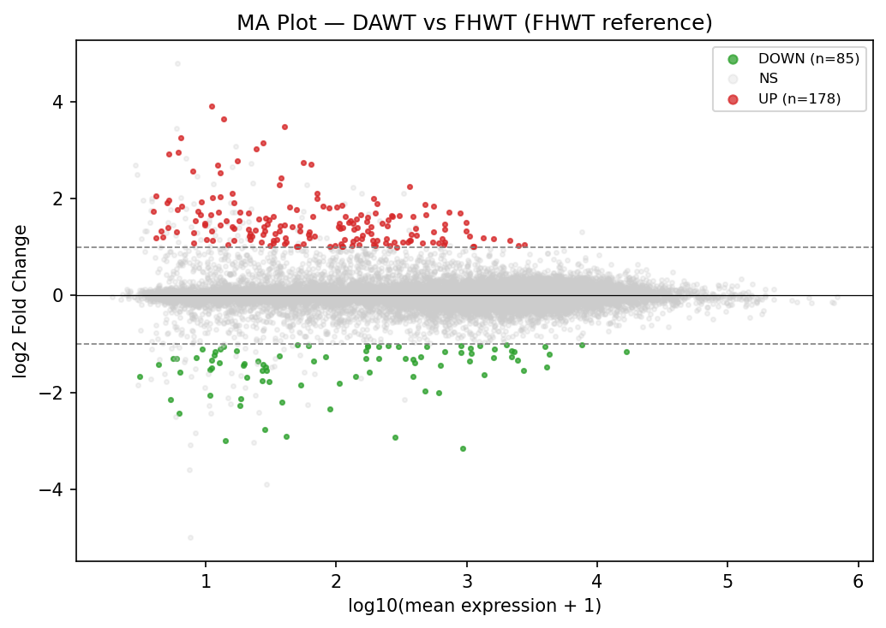

Mean expression (log2 of normalised counts, x-axis) versus log2 fold change (y-axis) for all 17,341 genes. Significant DEGs are coloured by direction: red (DAWT-enriched/anaplastic program), green (FHWT-enriched). LFC shrinkage (apeglm) is applied; the plot illustrates the absence of fold-change inflation at low expression levels. Dashed horizontal line marks log2FC = 0.

---

**Figure S6. Z-score heatmap — top 50 DEGs, DAWT vs FHWT.**
(de_hist_03_heatmap.png)

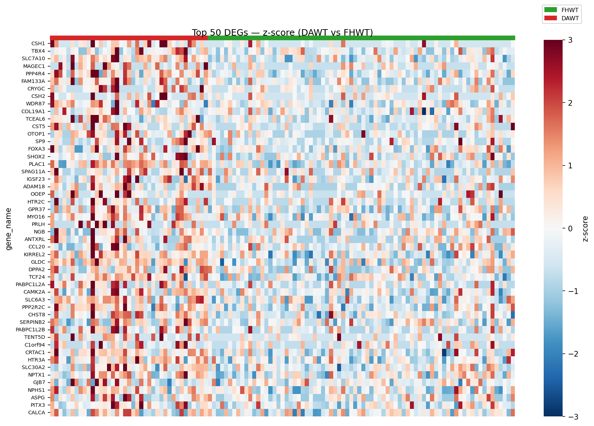

Hierarchically clustered z-score heatmap of the top 50 DEGs by absolute log2FC, using log2-normalised counts. Samples are sorted by histology (FHWT, DAWT). Colour bars indicate histological subtype. DAWT-enriched genes in the upper cluster include markers of progenitor identity (*DNTT*, *SOX15*) and stromal differentiation (*MYOCD*). FHWT-enriched genes in the lower cluster reflect blastemal and early nephronic differentiation programs.

---

**Figure S7. Wilms tumor driver panel — log2FC, DAWT vs FHWT.**
(de_hist_04_wilms_genes.png)

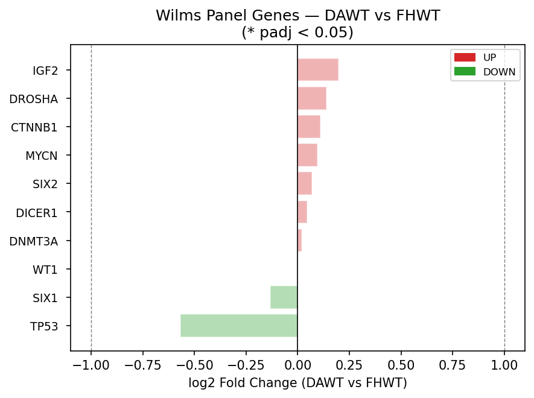

Horizontal bar chart showing log2 fold changes for the 11 canonical Wilms tumor driver genes (*WT1*, *CTNNB1*, *WTX*, *TP53*, *SIX1*, *SIX2*, *DROSHA*, *DICER1*, *IGF2*, *MYCN*, *DNMT3A*) in the DAWT vs FHWT comparison (FHWT reference frame; positive values = higher in DAWT). Bars are coloured by LFC sign. Genes reaching padj < 0.05 regardless of the |LFC| > 1.0 threshold are marked with an asterisk (*). *TP53* is the only significant panel gene (padj = 0.0003, |LFC| = 0.56), with modest but consistent reduced expression in DAWT, consistent with nonsense-mediated decay of loss-of-function alleles.

---

### Differential Expression: FHWT Relapse vs Progression (Step 2)

---

**Figure S8. Volcano plot — FHWT Relapse vs Progression, female-only (n = 36 Relapse, n = 4 Progression).**
(de_rel_fhwt_01_volcano.png)

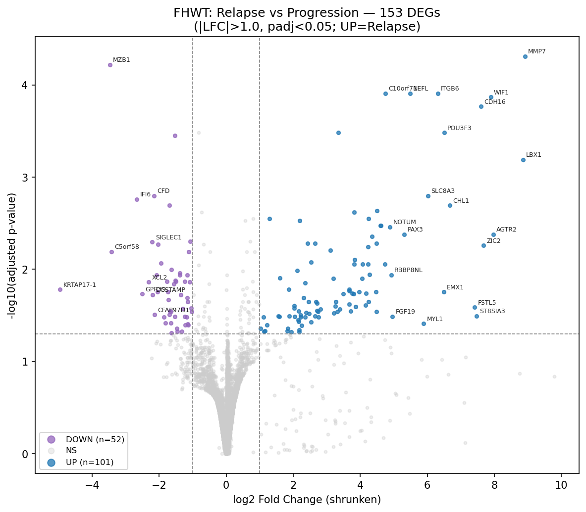

Volcano plot for the primary FHWT outcome comparison, restricted to female patients to eliminate the Y-chromosome sex confound (all 4 FHWT progressors are female; 33/69 relapsers are male). All specimens are primary tumors; outcome labels are retrospective. Genes upregulated in secondary resistance (Relapse) are shown in blue (n = 101); genes upregulated in primary resistance (Progression) are shown in purple (n = 52). 153 total DEGs. Top Relapse-enriched genes include *MMP7*, *WIF1*, *CDH16*, and *POU3F3* (Wnt-active, nephron-like program); top Progression-enriched genes include *MZB1*, *SIGLEC1*, *IFI6*, and *CFD* (immune/inflammatory baseline).

---

**Figure S9. MA plot — FHWT Relapse vs Progression, female-only.**
(de_rel_fhwt_02_ma.png)

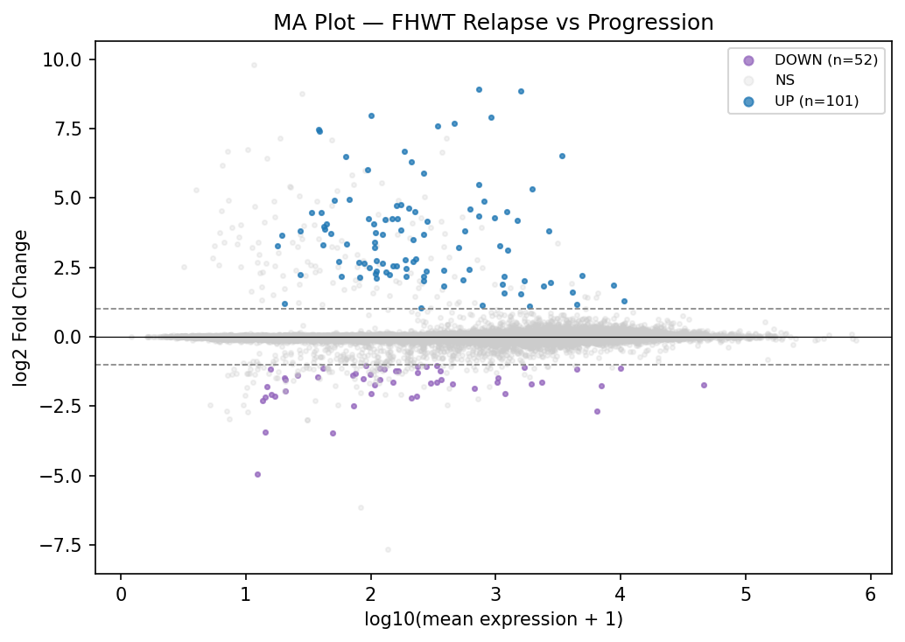

Mean expression versus log2 fold change for the FHWT female-only outcome comparison. Positive LFC indicates higher expression in secondary resistance (Relapse); negative LFC indicates higher expression in primary resistance (Progression). LFC shrinkage applied. Dashed horizontal line marks log2FC = 0.

---

**Figure S10. Z-score heatmap — top 50 DEGs, FHWT Relapse vs Progression (female-only).**
(de_rel_fhwt_03_heatmap.png)

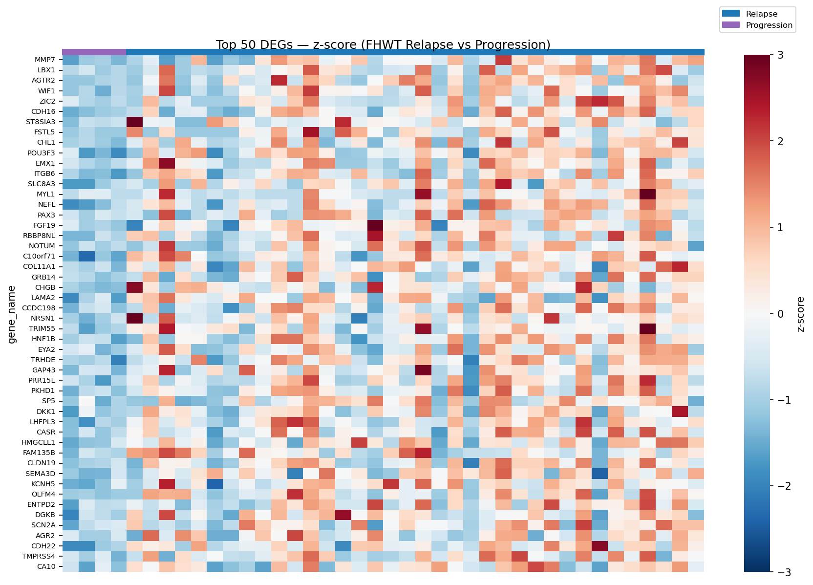

Z-score heatmap of the top 50 DEGs by absolute log2FC, using log2-normalised counts from the female-only subcohort. Samples are sorted by outcome group (Relapse, Progression). The heatmap illustrates the transcriptional separation between primary resistance (immune-enriched) and secondary resistance (Wnt/epithelial-enriched) primary tumor profiles at diagnosis, before any treatment.

---

**Figure S11. Wilms tumor driver panel — log2FC, FHWT Relapse vs Progression (female-only).**
(de_rel_fhwt_04_wilms_genes.png)

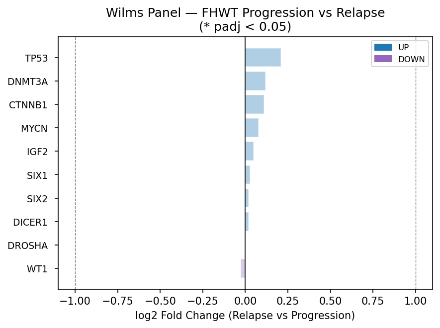

Log2 fold changes for the 11 canonical Wilms driver panel genes in the FHWT Relapse vs Progression comparison (Progression reference; positive values = higher in Relapse/secondary resistance). None of the Wilms panel genes reach significance at |LFC| > 1.0 and padj < 0.05, consistent with the shared FHWT mutational background of both outcome groups. Sub-threshold values for individual panel genes are shown for completeness.

---

**Figure S12. Volcano plot — DAWT Relapse vs Progression, exploratory analysis (n = 15 Relapse, n = 3 Progression).**
(de_rel_dawt_01_volcano.png)

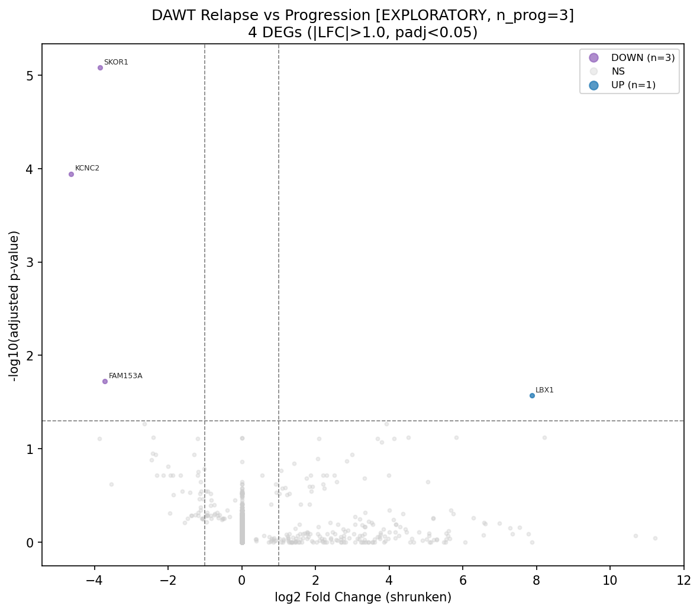

Volcano plot for the DAWT outcome comparison. Only 4 DEGs reach significance at |LFC| > 1.0 and padj < 0.05, reflecting severely limited statistical power at n = 3 DAWT progressors. *KCNC2*, *SKOR1*, and *FAM153A* (neural/neurodevelopmental markers) are upregulated in DAWT progressors; *LBX1* is upregulated in DAWT relapsers. Results are presented for hypothesis generation only and should not be interpreted as definitive.

---

### Differential Expression: Anaplastic Transformation Paired Analysis (Step 3)

---

**Figure S13. Volcano plot — Anaplastic Transformation, paired Primary→Recurrent (n = 4 patients).**
(de_at_01_volcano.png)

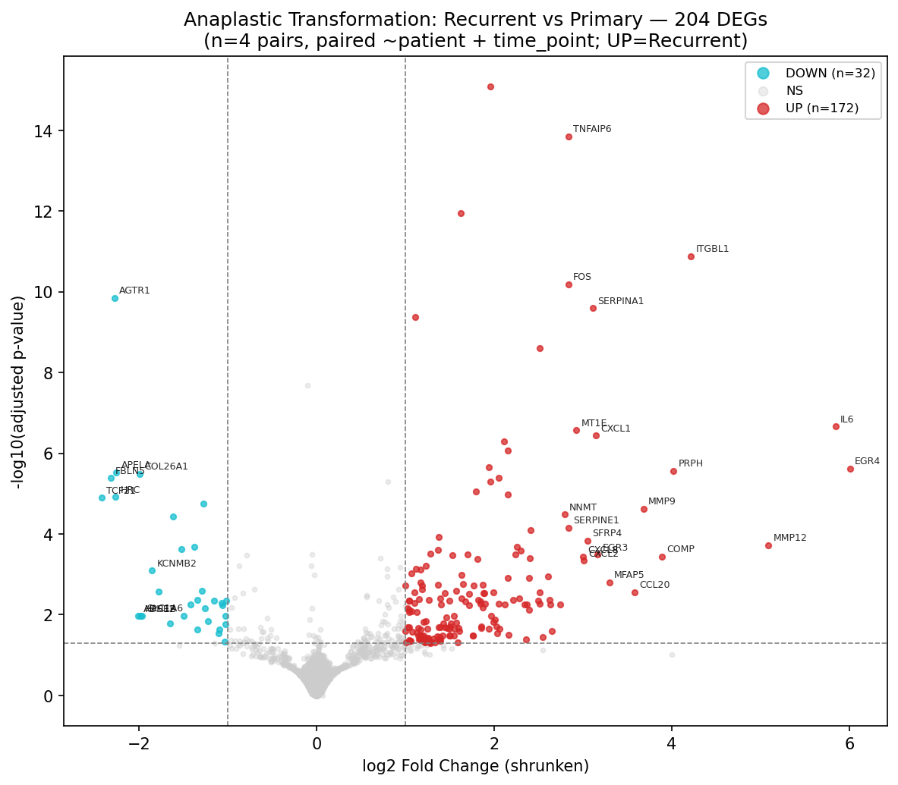

Volcano plot for the paired longitudinal comparison of 4 confirmed FHWT primary and anaplastic recurrent specimens. Paired design (~patient + time_point; residual df = 3); results are exploratory. Genes upregulated in anaplastic recurrence (positive LFC) are shown in red (n = 172); genes upregulated in FHWT primary are shown in cyan (n = 32). 204 total DEGs. Top anaplastic-upregulated genes include *ABCB1* (MDR1/P-gp), *IL6*, *CTHRC1*, *TNFAIP6*, and *PTGS1*; top downregulated genes include *AGTR1*, *FBLN5*, *TCF21*, and *HOXB6*.

---

**Figure S14. MA plot — Anaplastic Transformation paired analysis.**
(de_at_02_ma.png)

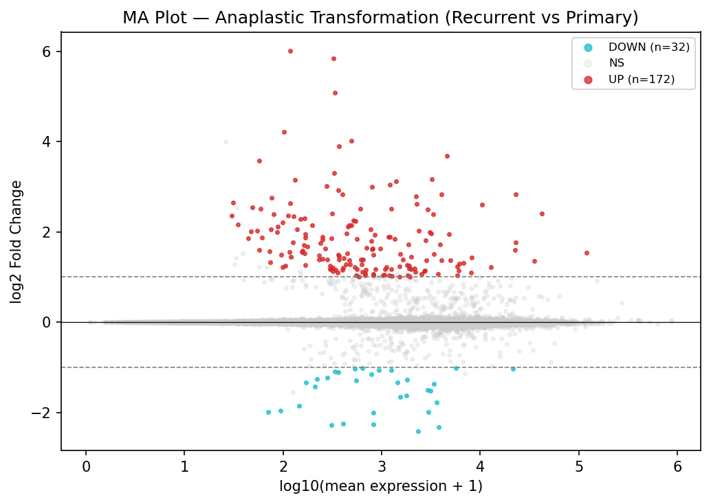

Mean expression versus log2 fold change for the AT paired comparison. Positive LFC indicates upregulation in anaplastic recurrence. The large imbalance between up- and down-regulated genes (172 vs 32) is visible as an asymmetric distribution above the log2FC = 0 line, indicating that anaplastic transformation is principally an activating transcriptional event.

---

**Figure S15. Z-score heatmap — top 40 DEGs, Anaplastic Transformation.**
(de_at_03_heatmap.png)

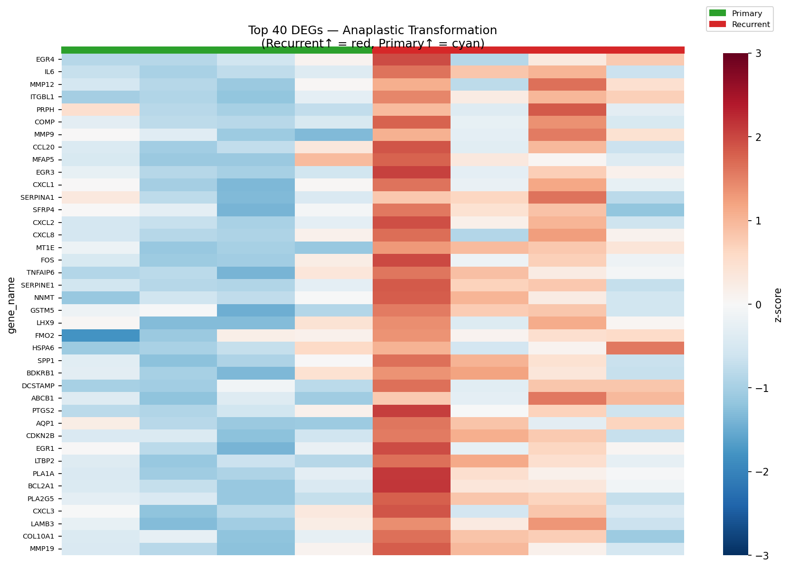

Z-score heatmap of the top 40 DEGs by absolute log2FC in the AT paired comparison, using log2-normalised counts. Samples are sorted by time point (Primary, Recurrent) and coloured by patient to illustrate the within-patient pairing structure. Upregulated genes in the anaplastic recurrence cluster include chemoresistance (*ABCB1*), inflammatory remodeling (*TNFAIP6*, *CTHRC1*), and cytokine (*IL6*, *IL1B*) markers. Downregulated genes reflect suppression of the original FHWT stromal and nephron-patterning identity (*TCF21*, *FBLN5*, *HOXB6*).

---

**Figure S16. Wilms tumor driver panel — log2FC, Anaplastic Transformation.**
(de_at_04_wilms_genes.png)

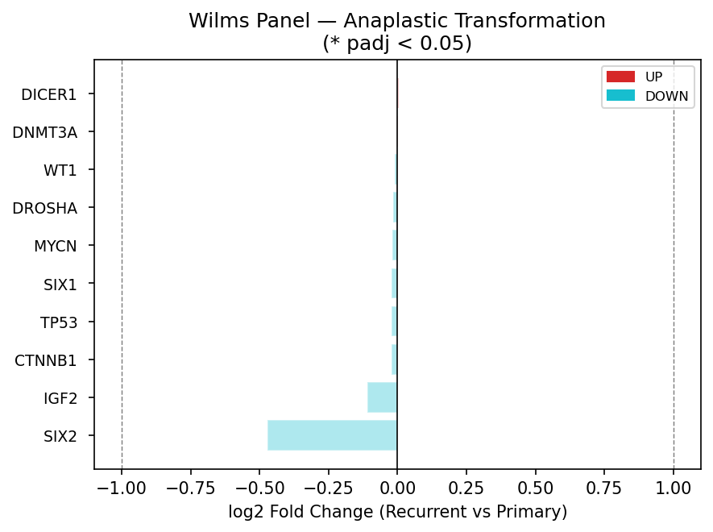

Log2 fold changes for the 11 canonical Wilms driver panel genes in the AT Primary→Recurrent comparison (Primary reference; positive values = upregulated in anaplastic recurrence). None of the Wilms panel genes reach significance at |LFC| > 1.0 and padj < 0.05, likely reflecting insufficient power at n = 4 pairs rather than a genuine absence of panel gene dysregulation. Sub-threshold *TP53* behaviour should be interpreted cautiously, as all four AT patients carry *TP53* mutations by pathological definition, and bulk transcript levels are not a reliable readout of mutant *TP53* gain-of-function activity.

---

### DAWT Relapse vs Progression — Exploratory Analysis (Figure 5)

With only 3 DAWT progressors, statistical power for this comparison is severely limited. Only 4 DEGs reach significance: *KCNC2*, *SKOR1*, and *FAM153A* are upregulated in DAWT progressors (i.e., lower in DAWT relapsers), all of which encode neural or neurodevelopmental proteins. *LBX1* is upregulated in DAWT relapsers. These results are presented for completeness and hypothesis generation only. The neuronal marker enrichment among DAWT progressors may reflect the known blastemal/neural crest biology of anaplastic tumors, but the sample size precludes any firm conclusion.

### Pathway and Gene Set Enrichment Analysis

---

**Figure S17. Over-representation analysis — AT-specific UP (n = 163) and AT DOWN (n = 32) gene sets.**
(enrich_01_ora_at_dotplot.png)

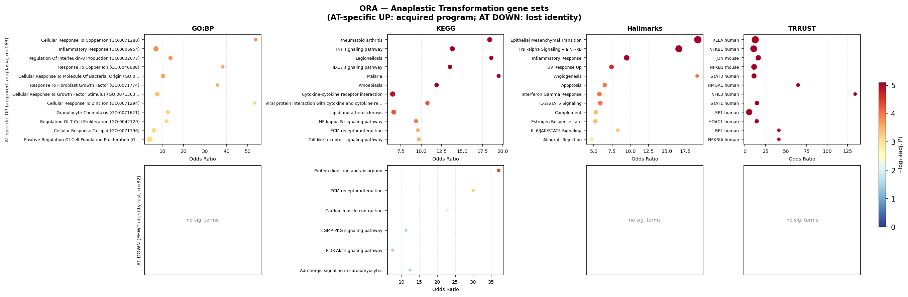

ORA dot plot for the AT-specific acquired anaplasia program across GO Biological Process 2023, KEGG 2021 (Human), MSigDB Hallmarks 2020, and TRRUST Transcription Factors 2019. Dot size represents the number of overlapping genes; colour encodes −log10(BH-adjusted P-value). Only terms with adjusted P < 0.05 are shown. Top AT-specific UP terms: Epithelial Mesenchymal Transition (Hallmarks; OR = 19.2, padj = 4.9 × 10⁻²²), TNF-alpha Signaling via NF-κB (Hallmarks; OR = 16.6, padj = 1.1 × 10⁻¹⁸), TNF signaling pathway (KEGG), and RELA/NFKB1/JUN (TRRUST). AT DOWN terms are sparser: KEGG Protein digestion and absorption (OR = 37.1, padj = 4.1 × 10⁻⁵) reflects loss of FHWT stromal ECM identity.

---

**Figure S18. Over-representation analysis — de novo DAWT UP (n = 94) and FHWT-enriched (n = 173) gene sets.**
(enrich_02_ora_dawt_fhwt_dotplot.png)

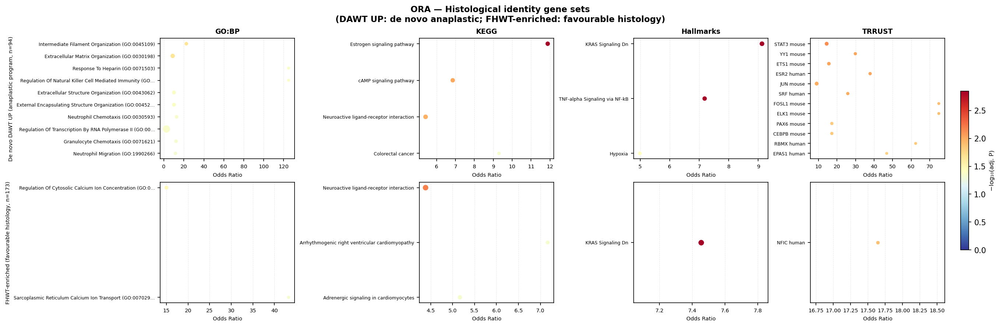

ORA dot plot for the histological identity comparison gene sets. DAWT UP: top Hallmarks term is KRAS Signaling Dn (OR = 9.1, padj = 1.7 × 10⁻⁴) alongside TNF-alpha Signaling via NF-κB (OR = 7.2, padj = 1.3 × 10⁻³); TRRUST identifies STAT3 and ESR2 as upstream regulators. The shared KRAS Dn enrichment across both DAWT UP and FHWT-enriched sets reflects the absence of RAS/MAPK hyperactivation in both primary histological classes. FHWT-enriched ORA yields sparse enrichment — consistent with FHWT representing a transcriptionally heterogeneous, developmentally mixed state.

---

**Figure S19. Over-representation analysis — secondary resistance UP (n = 101) and primary resistance UP (n = 52) gene sets.**
(enrich_03_ora_resistance_dotplot.png)

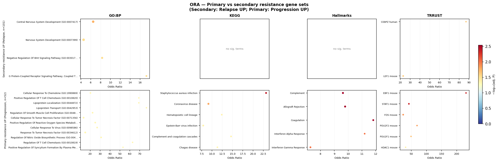

ORA dot plot contrasting the two FHWT resistance mode programs. Primary resistance (progression-enriched) yields dense immune hallmark enrichment: Allograft Rejection (OR = 9.8, padj = 2.3 × 10⁻³), Complement (OR = 9.6, padj = 2.3 × 10⁻³), Coagulation (OR = 11.8, padj = 2.8 × 10⁻³), Interferon Gamma Response (OR = 7.3, padj = 9.8 × 10⁻³), and STAT1/EBF1 as upstream TF regulators (TRRUST). Secondary resistance (relapse-enriched) shows sparse enrichment limited to GO:BP CNS development and Negative Regulation of Wnt Signaling, with LEF1 as the sole significant TRRUST hit, consistent with Wnt-active, differentiated-relapse biology.

---

**Figure S20. GSEA NES bar chart — Step 1: DAWT vs FHWT (positive NES = FHWT-enriched, negative NES = DAWT-enriched).**
(enrich_04_gsea_step1_nes.png)

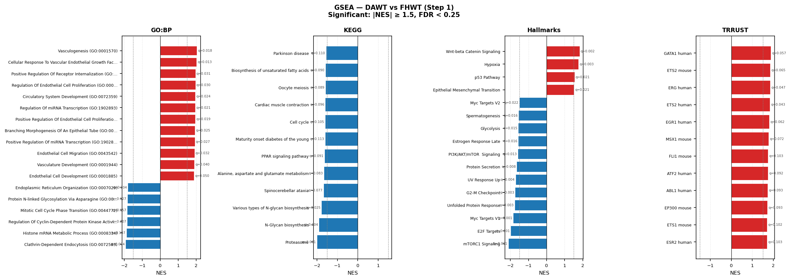

Normalised enrichment scores (NES) from preranked GSEA across all four databases for the FHWT-reference ranked list. Bars coloured red (positive NES, FHWT-enriched) or blue (negative NES, DAWT-enriched). Dashed lines mark |NES| = 1.5. Only terms with |NES| ≥ 1.5 and FDR < 0.25 are shown. The DAWT-enriched program is dominated by the MYC/E2F/mTOR proliferative axis: mTORC1 Signaling (NES = −2.11), E2F Targets (−1.98), MYC Targets V1 (−1.85), G2-M Checkpoint (−1.74). FHWT-enriched terms are led by Wnt-beta Catenin Signaling (NES = +1.83) and Hypoxia (+1.76), with GO:BP vasculogenesis and circulatory system development terms (NES ≈ 2.0) consistent with blastemal nephron-associated vascular programs.

---

**Figure S21. GSEA NES bar chart — Step 2: FHWT Relapse vs Progression (positive NES = secondary resistance/Relapse, negative NES = primary resistance/Progression).**
(enrich_05_gsea_step2_nes.png)

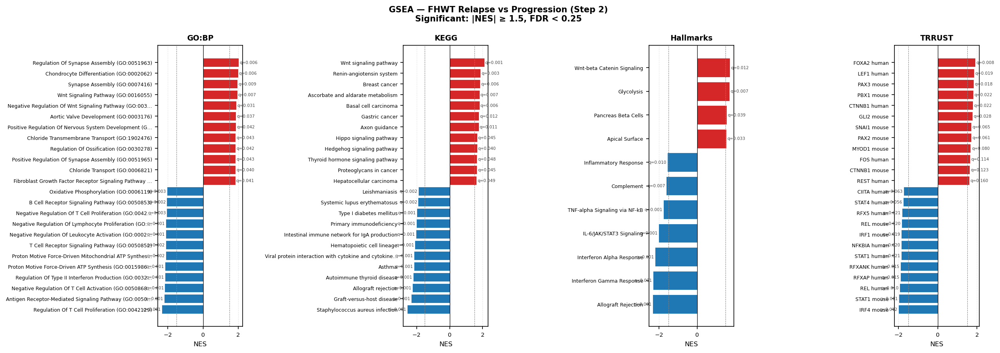

NES bar chart for the FHWT outcome comparison. The primary resistance program (negative NES) is defined by a coherent immune hallmark cluster: Allograft Rejection (NES = −2.33), Interferon Gamma Response (−2.32), Interferon Alpha Response (−2.21), IL-6/JAK/STAT3 Signaling (−2.01), and Complement (−1.62), with STAT1 and REL as TRRUST upstream regulators. The secondary resistance program (positive NES) is led by Wnt-beta Catenin Signaling (+1.72), Glycolysis (+1.71), and Wnt signaling pathway (KEGG; NES = +2.10), with LEF1, PAX3, and CTNNB1 as TF regulators. The asymmetry between the dense primary resistance immune signal and the sparse secondary resistance Wnt/epithelial signal highlights these as biologically orthogonal resistance circuits.

---

**Figure S22. GSEA NES bar chart — Step 3: AT Recurrent vs Primary (positive NES = acquired anaplastic program, negative NES = lost FHWT identity).**
(enrich_06_gsea_step3_nes.png)

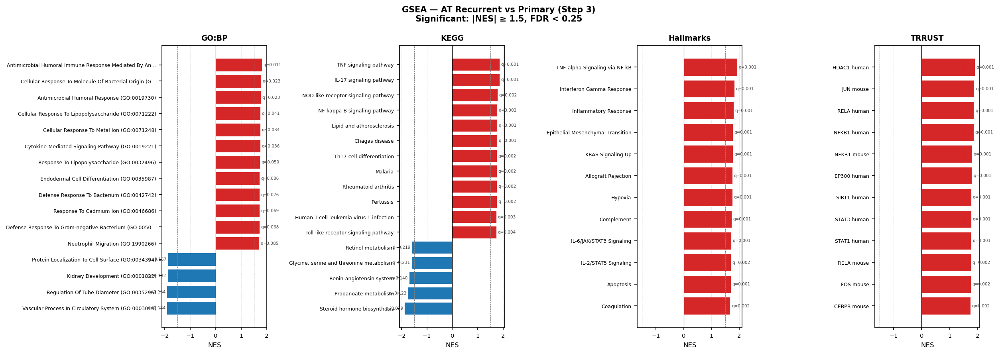

NES bar chart for the AT paired comparison. The acquired anaplastic program encompasses 17 significant positive Hallmarks terms (all FDR < 0.025): TNF-alpha Signaling via NF-κB (NES = 1.93), Interferon Gamma Response (1.83), Inflammatory Response (1.81), Epithelial Mesenchymal Transition (1.77), KRAS Signaling Up (1.77), Allograft Rejection (1.76), Hypoxia (1.75), Complement (1.73), IL-6/JAK/STAT3 Signaling (1.71), IL-2/STAT5 Signaling (1.70), Apoptosis (1.70), Coagulation (1.68), Interferon Alpha Response (1.66), and TGF-beta Signaling (1.51). TRRUST upstream regulators: RELA, NFKB1, and JUN (all NES > 1.85, FDR < 0.001). The lost FHWT identity program is represented by Steroid hormone biosynthesis (KEGG; NES = −1.89) and Renin-angiotensin system suppression. KRAS Signaling Up appearing in AT recurrence — juxtaposed against KRAS Signaling Dn enrichment in primary tumor histological programs — marks a striking inversion of RAS effector output at transformation.

---

**Figure S23. KEGG pathway heatmap across all six gene sets.**
(enrich_08_kegg_heatmap.png)

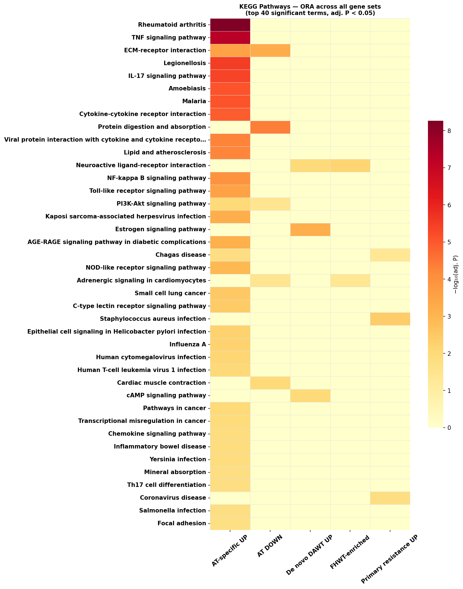

Heatmap of −log10(ORA BH-adjusted P-value) for KEGG 2021 Human terms that are significant (adjusted P < 0.05) in at least one of the six gene sets (AT-specific UP, AT DOWN, DAWT UP, FHWT-enriched, Secondary resistance UP, Primary resistance UP). White cells indicate non-significance. Key patterns: TNF signaling pathway and IL-17 signaling pathway are AT-specific dominant terms; Complement and coagulation cascades / Hematopoietic cell lineage are primary resistance-specific; Wnt signaling pathway enrichment in secondary resistance gene sets; Estrogen signaling and Neuroactive ligand-receptor interaction in DAWT. Provides a cross-comparison KEGG complement to the MSigDB Hallmarks heatmap in the main figures.

---

**Figure S24. PPI network centrality metrics — AT-specific UP gene set (n = 78 connected nodes).**
(enrich_09_ppi_centrality.png)

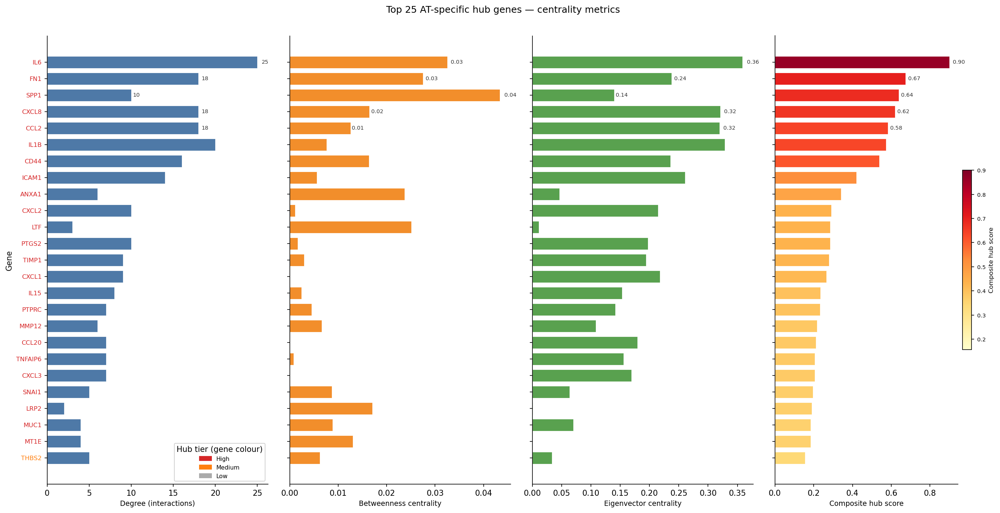

Scatter and bar visualisation of the three centrality metrics computed for all 78 connected nodes in the AT-specific PPI network (STRING confidence ≥ 700): degree centrality (normalised fraction of possible edges), betweenness centrality (fraction of all-pairs shortest paths), and eigenvector centrality (recursive connectivity to highly-connected neighbours). All metrics are min–max normalised. The composite hub score (0.4 × degree + 0.4 × betweenness + 0.2 × eigenvector) and hub tier assignment (High ≥ 70th percentile; Medium ≥ 40th; Low < 40th) are shown for all nodes. SPP1 ranks first by betweenness (0.043) despite ranking 9th by degree — identifying it as the principal structural bottleneck bridging Modules 1 (cytokine), 2 (ECM), and 3 (EMT).

---

**Figure S25. TF regulon UpSet plot — RELA, NFKB1, JUN, and STAT3 direct targets in the AT-specific UP gene set.**
(enrich_11_tf_regulon_upset.png)

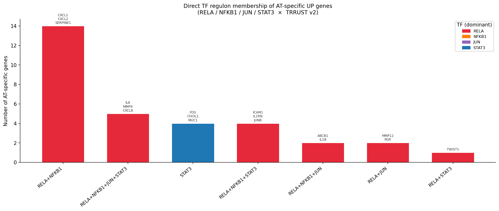

UpSet plot showing set intersections of direct TRRUST v2 regulatory relationships between the four focal transcription factors (RELA, NFKB1, JUN, STAT3) and the AT-specific UP gene set. Each bar represents a distinct intersection; point-and-line matrix below indicates which TF sets are intersected. The canonical NF-κB core (RELA + NFKB1 + JUN triple intersection) is the largest distinct group (10 genes including *IL6*, *CXCL8*, *PTGS2*, *ABCB1*, *IL1B*, *ICAM1*). RELA + NFKB1 without JUN (13 genes) includes *SNAI1*, *FN1*, *BCL2A1*. JUN-only targets (4 genes: *SPP1*, *CTSK*, *MMP19*, *DCSTAMP*) are structurally distinct from the NF-κB regulon. STAT3-unique targets (3 genes: *MUC1*, *CHI3L1*, *ZFP36*) form the smallest set. This partition demonstrates that NF-κB directly transcribes both master EMT regulators (*SNAI1*, *TWIST1*) and the principal chemoresistance gene (*BCL2A1*) in the AT program.

---

**Figure S26. TF regulon heatmap — direct target membership matrix, RELA, NFKB1, JUN, STAT3.**
(enrich_12_tf_regulon_heatmap.png)

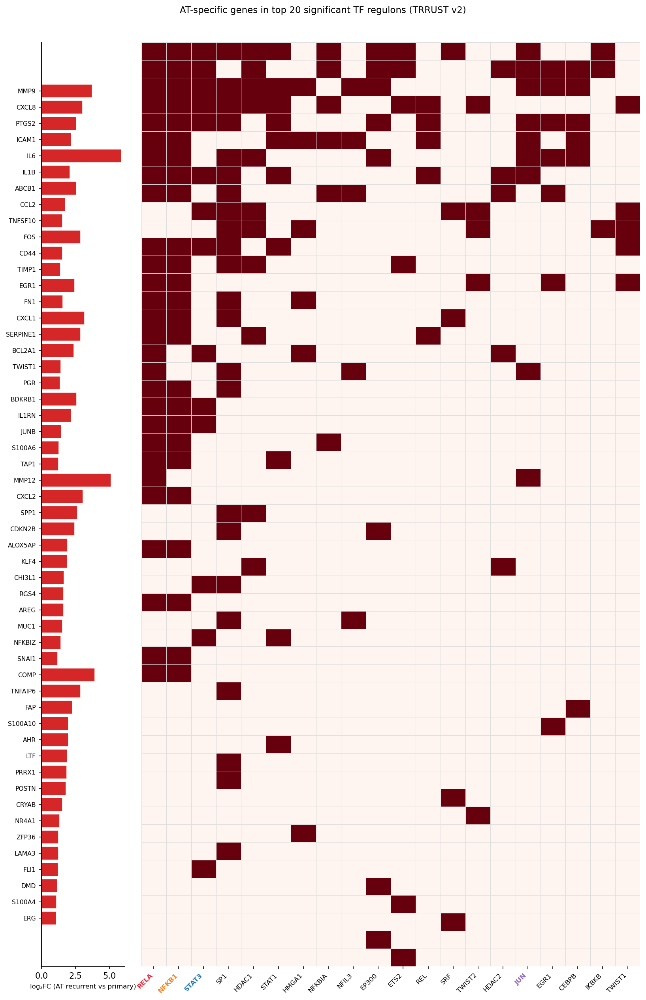

Binary membership heatmap for the 33 AT-specific UP genes with confirmed TRRUST v2 regulatory relationships to RELA, NFKB1, JUN, or STAT3. Rows = genes (clustered by membership pattern); columns = TFs. Filled cells indicate a documented TF→target regulatory relationship. Genes are annotated with their log2FC in the AT paired comparison and their PPI module assignment (cytokine core C1, ECM/matrix C2, EMT/adhesion C3, AP-1/stress C4, or S100/annexin C6). *BCL2A1* (LFC = 2.37, top-ranked) is highlighted as the highest-LFC RELA+NFKB1 direct target, encoding a BCL2-family anti-apoptotic protein with limited sensitivity to approved BH3 mimetics.

---

